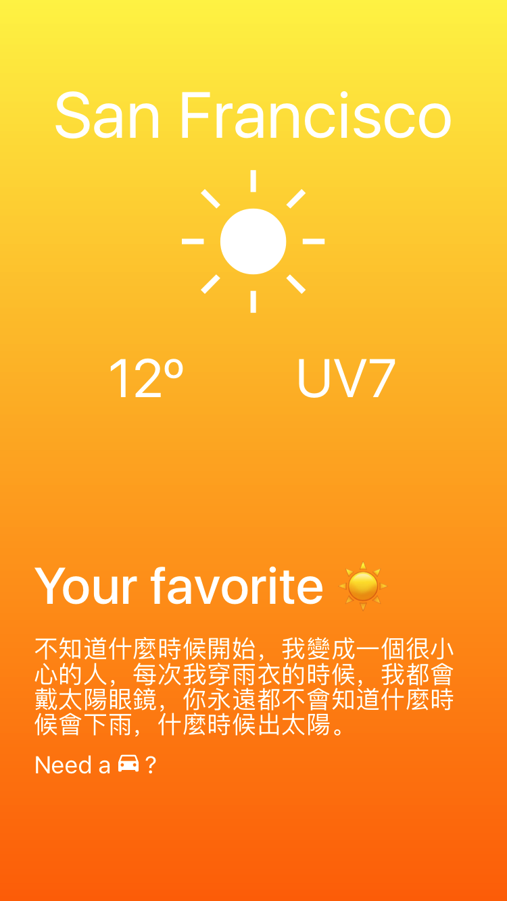
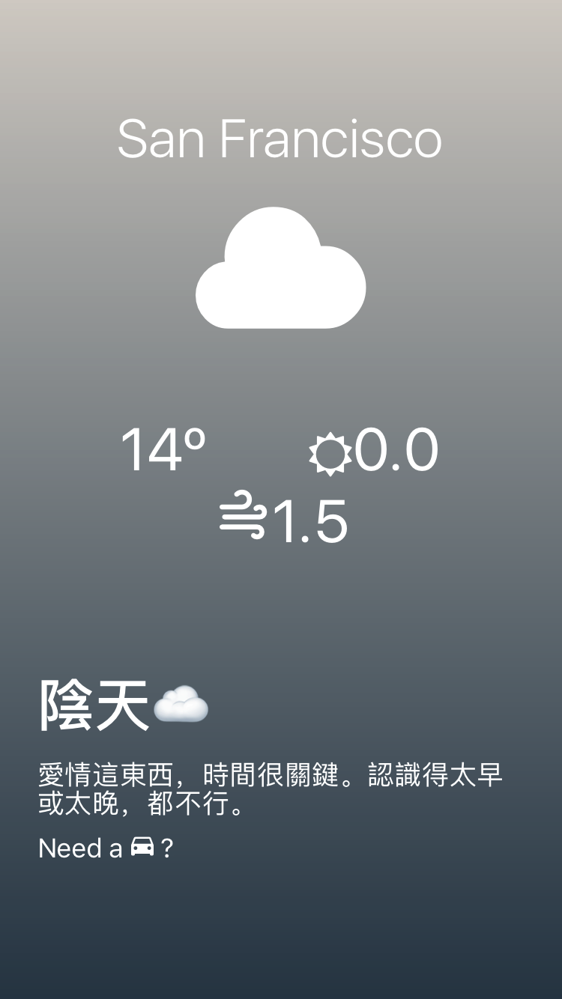
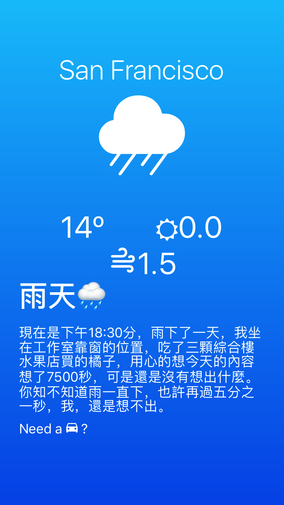

# Welcome to Lovely Weather App
A weather application built with react native
## Demo

## Instructions
1. Git clone repository
1. `cd weather_app`
1. `npm install`
1. If you don't have Expo installed on your computer, please refer to [expo installation guide](https://docs.expo.io/versions/latest/introduction/installation)
1.  `exp start`
1.  `exp ios`
